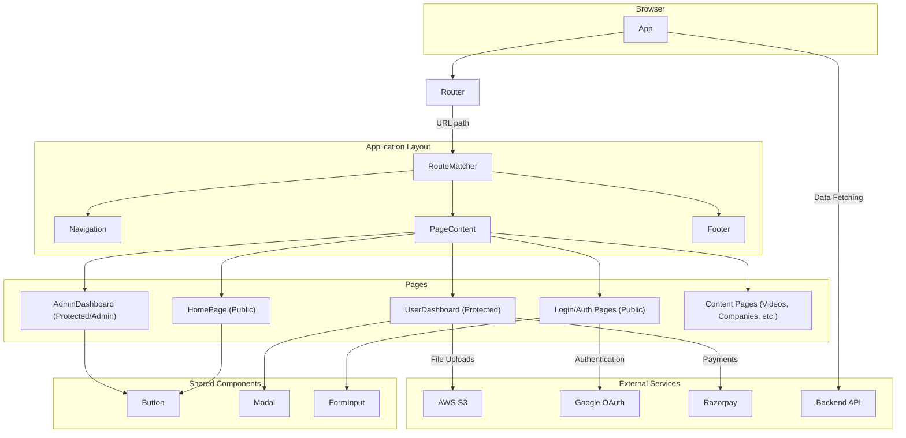
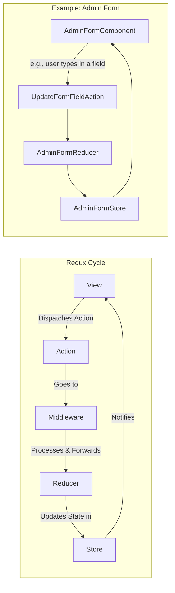

# Architecture Overview

This document provides a comprehensive overview of the project's architecture, designed to help new developers understand the codebase and its underlying principles.

## 1. Frontend Architecture

The frontend is a single-page application (SPA) built with **React** and **Vite**, using **TypeScript** for type safety. It follows a component-based architecture, with a clear separation of concerns between different modules.

### 1.1. Project Structure

The project is organized into the following key directories:

- **`/public`**: Contains static assets like images, fonts, and the main `index.html` file.
- **`/src`**: The main application source code, including all components, routing, and state management logic.
  - **`/components`**: Contains all React components, further organized by feature or domain (e.g., `Admin`, `UserDashboard`, `company`).
  - **`/main.tsx`**: The application's entry point, where the root React component is rendered.
  - **`/App.tsx`**: The root component, responsible for setting up routing and the main application layout.

### 1.2. Routing

Routing is managed by **React Router**, which maps URLs to specific components. The main routing configuration is in `src/App.tsx`, where different routes are defined for public pages, user dashboards, and admin panels. Protected routes are implemented to restrict access to authenticated users.

### 1.3. State Management

The application uses **Redux** for global state management, particularly for features like the admin form. The Redux store, actions, and reducers are defined in the relevant feature directories. For component-level state, React's built-in hooks (`useState`, `useReducer`) are used.

### 1.4. Component Hierarchy

The application follows a hierarchical component structure:

- **App-level components**: `Navigation`, `Footer`, and layout components that are present on most pages.
- **Page-level components**: Components that represent entire pages, such as `HomePage`, `VideosPage`, and `AdminDashboard`.
- **Shared components**: Reusable components used across multiple pages, such as buttons, modals, and form inputs.

### 1.5. Styling

Styling is handled by **Tailwind CSS**, a utility-first CSS framework. This allows for rapid UI development by composing utility classes directly in the markup. Global styles and any custom CSS are defined in `src/index.css`.

## 2. Backend Architecture

The backend is built with a **serverless architecture** on **AWS**, using **Lambda** for compute and **API Gateway** for routing. This provides a scalable and cost-effective solution for handling API requests.

### 2.1. API Endpoints

The application interacts with several API endpoints, each corresponding to a specific Lambda function:

- **Dashboard Cards**: `https://v1lqhhm1ma.execute-api.ap-south-1.amazonaws.com/prod/dashboard-cards`
- **Form Structure**: `https://qemducz8gc.execute-api.ap-south-1.amazonaws.com/formstructure`
- **User and Professional Data**: `https://tvlifa6840.execute-api.ap-south-1.amazonaws.com/prod/{userId}/{professionalId}`
- **Payment Gateway**: `https://yv3392if0d.execute-api.ap-south-1.amazonaws.com/dev/drontv-token-buy-payment-gateway`
- **Events Dashboard**: `https://o9og9e2rik.execute-api.ap-south-1.amazonaws.com/prod/events-dashboard`
- **Token Plans**: `https://m6iy4nsz94.execute-api.ap-south-1.amazonaws.com/prod/dev`

## 3. Integrations and External Services

The application integrates with several external services to provide a comprehensive set of features.

### 3.1. AWS S3

**Amazon S3** is used for storing user-uploaded files, such as images and documents. The `@aws-sdk/client-s3` package is used to interact with the S3 API.

### 3.2. Google OAuth

**Google OAuth** is integrated for user authentication, providing a secure and convenient way for users to sign up and log in with their Google accounts. The `@react-oauth/google` package is used to implement the OAuth flow.

### 3.3. Razorpay

**Razorpay** is used for processing payments, allowing users to purchase tokens or other services. The `react-razorpay` package provides a seamless integration with the Razorpay payment gateway.

## 4. Deployment

The frontend application is hosted on **Vercel**, a cloud platform for static sites and serverless functions. The `vercel.json` file contains the configuration for the deployment, including any rewrite rules.

## 5. Visual Diagrams

### 5.1. High-Level Component Diagram



### 5.2. Routing Flow Diagram

```mermaid
graph TD
    A[User visits site] --> B{Is user authenticated?};
    B -- No --> C[Public Routes];
    B -- Yes --> D{Is user an admin?};

    C --> E[/];
    C --> F[/login];
    C --> G[/videos, /companies, etc.];

    D -- No --> H[User Routes];
    H --> I[/user-dashboard];
    H --> J[/user-profile];
    H --> K[/user-companies];

    D -- Yes --> L[Admin Routes];
    L --> M[/admin/dashboard];
    L --> N[/admin/company/dashboard];
    L --> O[/admin/plans];

    subgraph Public Routes
        direction LR
        E[HomePage]
        F[LoginPage]
        G[Content Pages]
    end

    subgraph User Routes
        direction LR
        I[UserDashboard]
        J[ProfilePage]
        K[UserCompany Page]
    end

    subgraph Admin Routes
        direction LR
        M[AdminDashboard]
        N[AdminCompanyDashboard]
        O[AdminTokenPlan]
    end
```

### 5.3. Redux Data Flow Diagram


